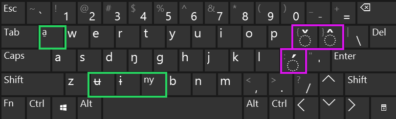

# fur-language
Fur language (poór'íŋ belé) [iso 639-3: fvr] resources, and computer aids.

# Keyboard maps:
## Orthography:
Basing our keyboard maps on the orthography suggested in the SIL publication Kutsch Lojenga and Waag 2004: "The sounds and tones of Fur" 
[https://www.sil.org/resources/publications/entry/35935] - this seems to be the accepted orthography is publications in these years at least (2004-2017)
## Layouts:
(todo - unicode way to render keyboard layouts?)
### Gray-Alt layout:
..
ʉ ɨ a̱ ŋ 
tone-marks: áâǎ 
### 'xcv' overriding layout (xcvqf) :
QWERTY layout - overriding unused letters in Fur (xcvqf), to Fur letters (a̱ ɨ ʉ ŋ ny).

Fur letters in green, tone marks in pink. Gray-alt + key - provides the original US-qwerty key below it.

## MacOS:
...

## Windows:
~~

## Mobile Platforms:
Not done yet. 
### Recommendations:
The google Gboard - which can be installed on both iOS and Android - ~~

