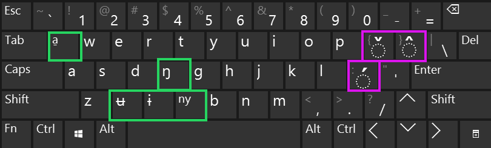

# fur-language
Fur language (poór'íŋ belé) [iso 639-3: fvr] resources, and computer aids.

# Keyboard maps:
## Orthography:
Basing our keyboard maps on the orthography suggested in the SIL publication Kutsch Lojenga and Waag 2004: "The sounds and tones of Fur"
[https://www.sil.org/resources/publications/entry/35935] - this seems to be the accepted orthography is publications in these years at least (2004-2017)
## Layouts:
(todo - unicode way to render keyboard layouts?)
### Gray-Alt layout:
..
ʉ ɨ a̱ ŋ
tone-marks: áâǎ
### 'xcv' overriding layout (xcvqf) :
QWERTY layout - overriding unused letters in Fur (xcvqf), to Fur letters (a̱ ɨ ʉ ŋ ny).

Fur letters in green, tone marks in pink. Gray-alt + key - provides the original US-qwerty key below it.

The two layouts can actually be installed and used on the same machine, alternating between them when you type in "mostly english" with a few Fur words or vice-versa, or till you see which one suits you better.

## MacOS:
Provided.

## Windows:
The provided keyboard, installs the keyboard layouts as "Maori"

## Mobile Platforms:

### Android:
[http://dominicweb.eu/en/dictionaries/african-keyboard/] -
[https://play.google.com/store/apps/details?id=eu.dominicweb.africankeyboard] - Dominic's keyboard - includes all Fur letters and tone-markings, in either in the "All African" keyboard, or the "Cameroon" settings (not in the Sudan or Chad setting currently). We'll contact him soon to sync about a Fur or more suitable Sudanese layout.

On the "multiling o keyboard honso" - we could also set a suitable keymap, delays soon.

### iOS:
No known keyboard.
Keyman - on some settings, _should_ provide something, esp now that Keyman is a SIL project.
